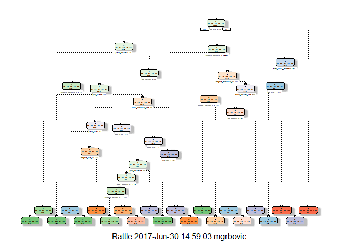

# Practical Machine Learning - Course Project
Miroslav Grbovic  
30 June 2017  


#Background
Using devices such as Jawbone Up, Nike FuelBand and Fitbit it is now possible to collect a large amount of data about personal activity relatively inexpensively. These type of devices are part of the quantified self movement a group of enthusiasts who take measurements about themselves regularly to improve their health, to find patterns in their behavior, or because they are tech geeks. One thing that people regularly do is quantify how much of a particular activity they do, but they rarely quantify how well they do it.

In this project, we will use data from accelerometers on the belt, forearm, arm and dumbell of 6 participants. They were asked to perform barbell lifts correctly and incorrectly in 5 different ways. The "classe" variable  contains 5 different ways barbell lifts were performed correctly and incorrectly:

* Class A: exactly according to the specification
* Class B: throwing the elbows to the front
* Class C: lifting the dumbbell only halfway
* Class D: lowering the dumbbell only halfway
* Class E: throwing the hips to the front


The goal of our project is to predict the manner in which they did the exercise - to predict the "classe" variable.


#Downloading and reading data

We are downloading and reading data from provided URLs:

```r
set.seed(54321)

trainUrl <- "http://d396qusza40orc.cloudfront.net/predmachlearn/pml-training.csv"
testUrl <- "http://d396qusza40orc.cloudfront.net/predmachlearn/pml-testing.csv"

download.file(trainUrl, destfile="train_data.csv")
download.file(testUrl, destfile="test_data.csv")

train_data  <- read.csv("train_data.csv", na.strings=c("NA","#DIV/0!",""))
test_data <- read.csv("test_data.csv", na.strings=c("NA","#DIV/0!",""))
```

#Cross-validation

Cross-validation techniques are used for estimating accuracy of Prediction Model on Test set by using the Training set i.e. out-of-sample accuracy of Prediction Model. Cross-validation approach is:

1. Use the Training set
2. Split it into training/test sets
3. Build a model on the training set
4. Evaluate on the test set

We are splitting Training data set into 2 data sets: 60% for training and 40% for testing:

```r
inTrain <- createDataPartition(y=train_data$classe, p = 0.60, list=FALSE)
training <- train_data[inTrain,]
testing <- train_data[-inTrain,]

dim(training)
```

```
## [1] 11776   160
```

```r
dim(testing)
```

```
## [1] 7846  160
```

#Expected out-of-sample error
The expected out-of-sample error will correspond to the quantity: 1-accuracy in the cross-validation data. Accuracy is the proportion of correct classified observation over the total sample in the subTesting data set. Expected accuracy is the expected accuracy in the out-of-sample data set (i.e. original testing data set). Thus, the expected value of the out-of-sample error will correspond to the expected number of missclassified observations/total observations in the testing data set, which is the quantity: 1-accuracy found from the cross-validation data set.

Our outcome variable "classe" is an unordered factor variable. Thus, we can choose our error type as 1-accuracy. 
##How the model was built
We have a large sample size in the Training data set. This allow us to divide our training data set into subTraining and subTesting data sets to allow cross-validation. Features with all missing values will be discarded as well as features that are irrelevant. All other features will be kept as relevant variables. Decision tree and random forest algorithms are known for their ability of detecting the features that are important for classification.

#Cleaning the data

In training data set, removing first 7 variables because these are made up of metadata that would cause the model to perform poorly:

```r
training <- training[,-c(1:7)]
```

In training data set, remove variables that have near zero variance (e.g. have one unique value):

```r
x <- nearZeroVar(training, saveMetrics=TRUE)
training <- training[, x$nzv==FALSE]
```

In training data set, remove variables that have 60% or more of the values as "NA":

```r
training_clean <- training
for(i in 1:length(training)) {
        if( sum( is.na( training[, i] ) ) /nrow(training) >= .6) {
                for(j in 1:length(training_clean)) {
                        if( length( grep(names(training[i]), names(training_clean)[j]) ) == 1)  {
                                training_clean <- training_clean[ , -j]
                        }   
                } 
        }
}

# Set the new cleaned up dataset back to the old dataset name
training <- training_clean
```

In test_data data set (original testing data set), remove variable "classe" as well as variables which are removed from training data set:

```r
#Drop the class variable:
columns <- colnames(training)
columns2 <- colnames(training[, -53])

#Subset test_data data set on the variables that are in the training data set:
test_data <- test_data[columns2]
dim(test_data)
```

```
## [1] 20 52
```

#Prediction with Random Forest machine learning algorithm

Random Forest model is built on the training data set, then the results are evaluated on the testing data set

```r
#Train the model for predicting variable "classe" with other variables
modFit <- randomForest(classe ~ ., data=training)

#Predict variable "classe" using testing data
prediction <- predict(modFit, testing)

#Get the confustion matrix to see prediction model accuracy
CMrf <- confusionMatrix(prediction, testing$classe)
print(CMrf)
```

```
## Confusion Matrix and Statistics
## 
##           Reference
## Prediction    A    B    C    D    E
##          A 2225    9    0    0    0
##          B    7 1504   10    0    0
##          C    0    5 1357   17    0
##          D    0    0    1 1269    4
##          E    0    0    0    0 1438
## 
## Overall Statistics
##                                           
##                Accuracy : 0.9932          
##                  95% CI : (0.9912, 0.9949)
##     No Information Rate : 0.2845          
##     P-Value [Acc > NIR] : < 2.2e-16       
##                                           
##                   Kappa : 0.9915          
##  Mcnemar's Test P-Value : NA              
## 
## Statistics by Class:
## 
##                      Class: A Class: B Class: C Class: D Class: E
## Sensitivity            0.9969   0.9908   0.9920   0.9868   0.9972
## Specificity            0.9984   0.9973   0.9966   0.9992   1.0000
## Pos Pred Value         0.9960   0.9888   0.9840   0.9961   1.0000
## Neg Pred Value         0.9988   0.9978   0.9983   0.9974   0.9994
## Prevalence             0.2845   0.1935   0.1744   0.1639   0.1838
## Detection Rate         0.2836   0.1917   0.1730   0.1617   0.1833
## Detection Prevalence   0.2847   0.1939   0.1758   0.1624   0.1833
## Balanced Accuracy      0.9976   0.9940   0.9943   0.9930   0.9986
```

##Model accuracy and expected out-of-sample error
The model is 99.32% accurate on the testing data partitioned from the training data. The expected out of sample error is roughly 0.68%:

```r
accuracy <- round(CMrf$overall['Accuracy'] * 100, 2)
print(accuracy)
```

```
## Accuracy 
##    99.32
```

```r
oos_error <- round(100*(1 - CMrf$overall['Accuracy']),2)
print(oos_error)
```

```
## Accuracy 
##     0.68
```


#Prediction with Decision Tree machine learning algorithm

Decision Tree model is built on the training data set, then the results are evaluated on the testing data set

```r
#Train the model for predicting variable "classe" with other variables
modFit2 <- rpart(classe ~ ., data=training, method="class")

#Predict variable "classe" using testing data
prediction2 <- predict(modFit2, testing, type="class")

#Get the confustion matrix to see prediction model accuracy
CMdt <- confusionMatrix(prediction2, testing$classe)
print(CMdt)
```

```
## Confusion Matrix and Statistics
## 
##           Reference
## Prediction    A    B    C    D    E
##          A 2047  317   41  147   65
##          B   44  736   62   35   61
##          C   60  185 1120  193  176
##          D   30  107   77  813   61
##          E   51  173   68   98 1079
## 
## Overall Statistics
##                                           
##                Accuracy : 0.7386          
##                  95% CI : (0.7287, 0.7483)
##     No Information Rate : 0.2845          
##     P-Value [Acc > NIR] : < 2.2e-16       
##                                           
##                   Kappa : 0.6676          
##  Mcnemar's Test P-Value : < 2.2e-16       
## 
## Statistics by Class:
## 
##                      Class: A Class: B Class: C Class: D Class: E
## Sensitivity            0.9171  0.48485   0.8187   0.6322   0.7483
## Specificity            0.8985  0.96808   0.9052   0.9581   0.9391
## Pos Pred Value         0.7822  0.78465   0.6459   0.7472   0.7345
## Neg Pred Value         0.9646  0.88680   0.9594   0.9300   0.9431
## Prevalence             0.2845  0.19347   0.1744   0.1639   0.1838
## Detection Rate         0.2609  0.09381   0.1427   0.1036   0.1375
## Detection Prevalence   0.3335  0.11955   0.2210   0.1387   0.1872
## Balanced Accuracy      0.9078  0.72646   0.8620   0.7951   0.8437
```

##Model accuracy and expected out-of-sample error
The model is 73.86% accurate on the testing data partitioned from the training data. The expected out of sample error is roughly 26%:

```r
accuracy <- round(CMdt$overall['Accuracy'] * 100, 2)
print(accuracy)
```

```
## Accuracy 
##    73.86
```

```r
oos_error <- round(100*(1 - CMdt$overall['Accuracy']),2)
print(oos_error)
```

```
## Accuracy 
##    26.14
```

We plot dendogram for Decision Tree model:

```r
fancyRpartPlot(modFit2)
```

<!-- -->

#Prediction on the Test data set
The Random Forest model gave an accuracy of 99.32%, which is much higher than the 73.86% accuracy from the Decision Tree. So we will use the Random Forest model to make the predictions on the test data set to predict the way 20 participates performed the exercise.


```r
final_prediction <- predict(modFit, test_data, type="class")
print(final_prediction)
```

```
##  1  2  3  4  5  6  7  8  9 10 11 12 13 14 15 16 17 18 19 20 
##  B  A  B  A  A  E  D  B  A  A  B  C  B  A  E  E  A  B  B  B 
## Levels: A B C D E
```

#Conclusion
There are many different machine learning algorithms. I chose to compare a Random Forest and Decision Tree model. For this data, the Random Forest proved to be a more accurate way to predict the manner in which the exercise was done.

